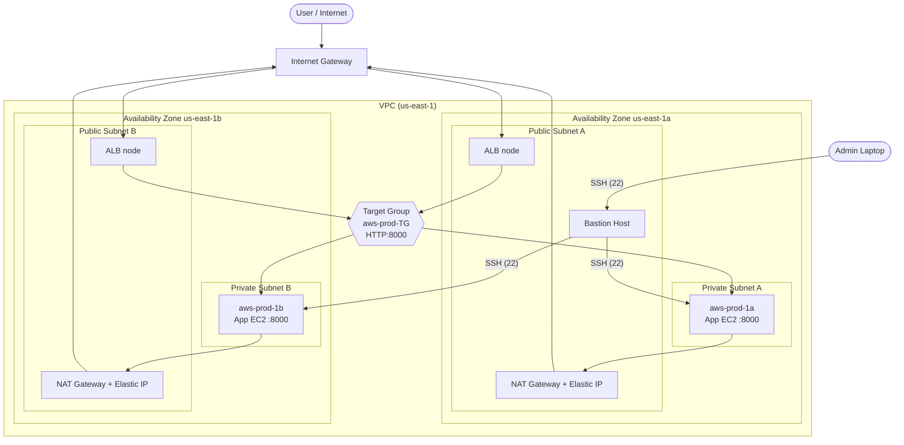
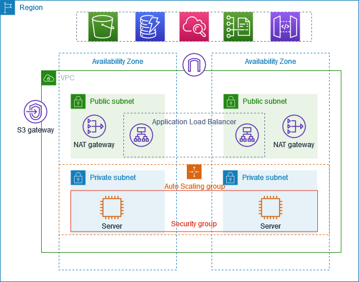

# AWS Multi-AZ Production Architecture: Public/Private Subnets with ALB, NAT Gateway, ASG & Bastion Host

A hands-on implementation of the AWS-recommended pattern for securely hosting applications on EC2: **app servers in private subnets**, with an **Application Load Balancer** and **NAT Gateway** in public subnets, spread across **two Availability Zones** for high availability.


---

## Table of Contents

1. [Project Overview](#project-overview)
2. [Architecture](#architecture)
3. [AWS Services Used](#aws-services-used)
4. [Resource Summary](#resource-summary)
5. [Prerequisites](#prerequisites)
6. [Implementation Steps](#implementation-steps)
7. [Testing & Verification](#testing--verification)
8. [Traffic Flow](#traffic-flow)
9. [Troubleshooting & Lessons Learned](#troubleshooting--lessons-learned)
10. [Security Considerations & Hardening](#security-considerations--hardening)
11. [Cost & Cleanup](#cost--cleanup)
12. [Repository Structure](#repository-structure)
13. [Key Takeaways](#key-takeaways)
---

## Project Overview

This project demonstrates how to create a VPC and secure applications inside it the way it is done in production:

- Applications run in **private subnets** with **no public IP addresses**.
- The **Application Load Balancer (ALB)** is the only public entry point for user traffic.
- A **NAT Gateway** lets private instances reach the internet (outbound only) while hiding their real IPs.
- A **Bastion host** in the public subnet is the only way to SSH into private instances.
- An **Auto Scaling Group (ASG)** keeps the desired number of instances running across both AZs.

### Why two Availability Zones?
If one AZ (data center) in the region goes down, the other keeps serving traffic.

### Why a NAT Gateway?
Private instances sometimes need to call external APIs or download packages. The NAT Gateway replaces the instance's private source IP with its own Elastic IP, so external services never learn the instance's real address.

---

## Architecture





---

## AWS Services Used

| Service | Purpose |
|---|---|
| **Amazon VPC** | Isolated network spanning two AZs |
| **Public Subnets (x2)** | Host the ALB, NAT Gateways and Bastion host |
| **Private Subnets (x2)** | Host the application EC2 instances |
| **Internet Gateway** | Inbound/outbound internet access for public subnets |
| **NAT Gateway (x2) + Elastic IP** | Outbound-only internet access for private instances |
| **EC2 Launch Template** | Reusable blueprint (AMI, instance type, key pair, SG) |
| **EC2 Auto Scaling Group** | Maintains desired capacity across private subnets |
| **Application Load Balancer** | Layer 7 load balancing, internet-facing |
| **Target Group** | Registers instances, performs health checks |
| **Security Groups** | Instance-level firewall rules |
| **Bastion Host** | SSH jump server into the private subnet |

---

## Resource Summary

| Resource | Value |
|---|---|
| Region | `us-east-1` (N. Virginia) |
| VPC |  (default IPv4 CIDR, 65,536 IPs, no IPv6) |
| Availability Zones | `us-east-1a`, `us-east-1b` |
| Subnets | 2 public + 2 private (one of each per AZ) |
| NAT Gateways | 1 per AZ |
| VPC Endpoints | None |
| Load Balancer | `aws-prod-ALB` (Application, Internet-facing, IPv4) |
| Listener | HTTP : 80 → target group `aws-prod-TG` |
| Target Group | `aws-prod-TG` (Target type: Instance, HTTP : 8000, HTTP1) |
| App instances | `aws-prod-1a` (us-east-1a), `aws-prod-1b` (us-east-1b), `t3.micro` |
| Bastion | `bastion-host` (public subnet, `t3.micro`, public IP enabled) |
| ASG capacity | Desired = 2 |
| App runtime | Python `http.server` on port `8000` |

---

## Prerequisites

- An AWS account with permissions for VPC, EC2, ELB and Auto Scaling
- An EC2 key pair (`.pem` file) available on your local machine
- Basic knowledge of SSH, Linux and networking (CIDR, routing)
- Free-tier eligible instance types recommended for a proof of concept

---

## Implementation Steps

### Step 1: Create the VPC

1. Open the **VPC** console → **Create VPC** → choose **VPC and more**.
2. Configure:
   - **Name tag:** `aws-prod-example`
   - **IPv4 CIDR:** default (65,536 IPs), **IPv6:** none
   - **Availability Zones:** 2
   - **Public subnets:** 2 | **Private subnets:** 2
   - **NAT gateways:** 1 per AZ
   - **VPC endpoints:** None (removes the unneeded S3 endpoint)
3. Click **Create VPC** and wait a few minutes for the NAT Gateways to become active.
4. Check the **Resource map**:
   - Public subnets → route table with a route to the **Internet Gateway**
   - Private subnets → separate route tables routing outbound traffic through the **NAT Gateway** in their AZ

### Step 2: Create the Launch Template and Auto Scaling Group

**Launch template**

1. EC2 → **Auto Scaling Groups** → **Create Auto Scaling group** → create a launch template.
2. Set: name `aws-prod-example`, Ubuntu AMI, free-tier instance type, your key pair.
3. Leave the subnet setting untouched.
4. Create a security group in the new VPC with inbound rules:
   - SSH, TCP `22`
   - Custom TCP, `8000` (application port)

**Auto Scaling Group**

1. Name: `aws-prod-example`, select the launch template.
2. Select the new VPC and the **private subnets** in `us-east-1a` and `us-east-1b`.
3. Load balancer: none for now (attached later via target group).
4. Desired capacity: **2**; set min/max capacity as needed; scaling policies: none; notifications: skip.
5. Verify in **EC2 → Instances** that two instances launched, one per AZ.

### Step 3: Launch the Bastion Host

1. EC2 → **Launch instance** → name `bastion-host`, Ubuntu, existing key pair.
2. **Network settings:** same VPC, a **public subnet**, **Auto-assign public IP: Enable**.
3. Security group allowing SSH (22).

### Step 4: Access the Private Instances via the Bastion

Copy the key to the bastion, then hop through it:

```bash
# 1. Copy the key from your laptop to the Bastion host
scp -i AWS_login.pem AWS_login.pem ubuntu@<BASTION_PUBLIC_IP>:~

# 2. SSH into the Bastion
ssh -i AWS_login.pem ubuntu@<BASTION_PUBLIC_IP>

# 3. From the Bastion, SSH into a private instance
ssh -i AWS_login.pem ubuntu@<PRIVATE_INSTANCE_IP>
```

> Tip: `chmod 400 AWS_login.pem` on both the laptop and the Bastion if SSH complains about key permissions.

### Step 5: Deploy the Application on the Private Instances

On **each** private instance, create an `index.html` and serve it on port 8000.

**Instance 1 (`aws-prod-1a`)**

```html
<!DOCTYPE html>
<html>
<body>
  <h1>AWS PROJECT</h1>
  <p>Project to demonstrate apps in private subnet.</p>
</body>
</html>
```

**Instance 2 (`aws-prod-1b`)**

```html
<!DOCTYPE html>
<html>
<body>
  <h1>AWS PROJECT 2</h1>
  <p>Project to demonstrate apps in private subnet 2..</p>
</body>
</html>
```

Start the server from the folder containing `index.html`:

```bash
python3 -m http.server 8000
```

### Step 6: Create the Target Group

1. EC2 → **Target Groups** → **Create target group**.
2. Target type: **Instances**, protocol **HTTP**, **port 8000**, the new VPC, health check **HTTP**.
3. Register both application instances and create the target group (`aws-prod-TG`).

### Step 7: Create the Application Load Balancer

1. EC2 → **Load Balancers** → **Create load balancer** → **Application Load Balancer**.
2. Name: `aws-prod-ALB`, scheme **Internet-facing**, IP type **IPv4**.
3. Select the new VPC and the **public subnets** in both AZs.
4. Security group: must allow inbound **HTTP 80** from anywhere (remove the default VPC group).
5. Listener: **HTTP : 80** → forward to `aws-prod-TG`.
6. Create and wait until the state is **Active**.

---

## Testing & Verification

1. Copy the ALB DNS name (`aws-prod-ALB-<id>.us-east-1.elb.amazonaws.com`) and open it in a browser.
2. **Phase 1 (app on one instance only):** the page loads intermittently because only the instance with the app is healthy, and the target group sends traffic only to healthy targets.
3. **Phase 2 (app on both instances):** with both targets healthy (`2 Healthy / 0 Unhealthy` in the target group), refreshing the ALB URL alternates between:
   - `AWS PROJECT`
   - `AWS PROJECT 2`

   This confirms the ALB is distributing requests across both AZs.

| Check | Expected result |
|---|---|
| ASG instances | 2 running instances, one in each AZ |
| Private instance public IP | None (only reachable via the Bastion) |
| Target group | 2 registered targets, all healthy |
| ALB state | Active |
| Browser → ALB DNS | Alternating responses from both instances |

Screenshots are in the [`screenshots/`](screenshots/) folder.

---

## Traffic Flow

```
User ──► Internet Gateway ──► ALB (public subnets)
                                  │
                                  ▼
                       Target Group (health-checked)
                                  │
                                  ▼
                  App EC2 in private subnet (AZ-a or AZ-b)
                                  │  (outbound only)
                                  ▼
                 NAT Gateway (public subnet, Elastic IP) ──► Internet

Admin laptop ──► Bastion host (public subnet) ──► App EC2 (private, SSH)
```

---

## Troubleshooting & Lessons Learned

| Problem | Cause | Fix |
|---|---|---|
| VPC creation failed: *maximum number of Elastic IPs reached* | Leftover unused Elastic IPs from earlier projects | Release unused EIPs in EC2, then **Retry** VPC creation |
| Target group showed unhealthy targets | Target group created on port 80 while the app runs on **8000** | Recreate the target group with port 8000 (or run the app on port 80) |
| ALB not reachable on port 80 | ALB security group did not allow the listener port | Add inbound rule **HTTP / 80 / 0.0.0.0/0** to the ALB security group |
| New target group not visible when creating the ALB | Propagation delay | Wait about a minute and refresh |
| ALB creation error | A private subnet was selected | ALB must use **public** subnets |

**Main lessons**
- Always match the **target group port** to the application port.
- The ALB security group must allow the **listener port**.
- Create things in order: VPC → Launch Template → ASG → Bastion → Target Group → ALB.
- The NAT Gateway needs an Elastic IP, so check your EIP quota.

---

## Security Considerations & Hardening

This project follows a tutorial setup that prioritises learning. For a real production workload, tighten the following:

- **Restrict SSH:** replace `0.0.0.0/0` on port 22 with your own IP (`/32`), or use **AWS Systems Manager Session Manager** and drop the Bastion entirely.
- **Chain security groups:** allow port `8000` on the app SG **only from the ALB's security group**, and SSH on the app SG **only from the Bastion's security group**.
- **Do not keep the `.pem` key on the Bastion long term.** Use SSH agent forwarding (`ssh -A`) or `ProxyJump` instead:
  ```bash
  ssh -J ubuntu@<BASTION_PUBLIC_IP> -i AWS_login.pem ubuntu@<PRIVATE_INSTANCE_IP>
  ```
- **Use HTTPS:** add an ACM certificate and an HTTPS (443) listener on the ALB.
- **Attach the ASG to the target group** so replacement instances register automatically, and use ELB health checks.
- **Bake the app into the launch template** via user data or a custom AMI instead of manual setup.
- Enable **VPC Flow Logs** and **ALB access logs** for auditing.

---

## Cost & Cleanup

NAT Gateways and Application Load Balancers are **billed hourly** even when idle. Two NAT Gateways plus Elastic IPs are the biggest cost in this project. Delete everything when done.

Suggested teardown order:

1. Delete the **Auto Scaling Group** (this terminates its instances)
2. Terminate the **Bastion host**
3. Delete the **Load Balancer**, then the **Target Group**
4. Delete the **Launch Template**
5. Delete the **VPC** (this removes subnets, route tables and the Internet Gateway; delete the **NAT Gateways** first and wait for them to finish deleting)
6. **Release the Elastic IPs**
7. Delete leftover **security groups** and the key pair if no longer needed

---

## Repository Structure

```
.
├── README.md
├── app/
│   ├── instance-1/index.html
│   └── instance-2/index.html
├── docs/
│   ├── architecture.png
└── screenshots/
    ├── 01-vpc-resource-map.png
    ├── 02-launch-template.png
    ├── 03-auto-scaling-group.png
    ├── 04-ec2-instances.png
    ├── 05-target-group-healthy.png
    ├── 06-alb-details.png
    ├── 07-alb-security-group-rule.png
    ├── 08-app-response-instance-1.png
    └── 09-app-response-instance-2.png
```

---

## Key Takeaways

- Keep application servers in **private subnets**; expose only the ALB (and a Bastion) publicly.
- Use **two AZs** so a single data-centre failure does not cause downtime.
- A **NAT Gateway** gives private instances outbound access without exposing them.
- An **Auto Scaling Group** maintains capacity; a **launch template** makes it repeatable.
- **Target group health checks** ensure traffic only reaches healthy instances.
- A **Bastion host** provides a single, auditable entry point for SSH.

---

## Author

**<Neha V M>**
[LinkedIn](https://www.linkedin.com/in/neha-v-m/) | [GitHub](https://github.com/<Neha-V-M>)

If this helped you, consider giving the repo a star.
